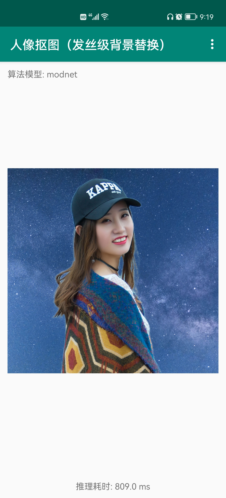

# human_matting_android_demo(换衣换脸工作流版)
基于[PaddleSeg](https://github.com/paddlepaddle/paddleseg/tree/develop)的[MODNet](https://github.com/PaddlePaddle/PaddleSeg/tree/develop/contrib/Matting)算法实现人像抠图（安卓版demo）。

相较于原版更新了下gradio和相关库的版本，对于新版本安卓有更好的体验；同时优化了预览效果，增加了换脸换衣功能。

# 1. 使用教程
## 部署好IDM-VTON和FaceFusino的服务端后，修改`app/src/main/res/values/strings.xml`中的`FACE_URL`和`TRYON_URL`为自己的服务端地址。

# 2. 效果展示

 

原图

新背景

在手机上进行人像抠图然后再替换背景：

# 3. 项目结构
整个安卓demo采用java实现，没有内嵌C++代码，构建和执行比较简单。未来也可以将本demo移植到java web项目中实现web版人像抠图。